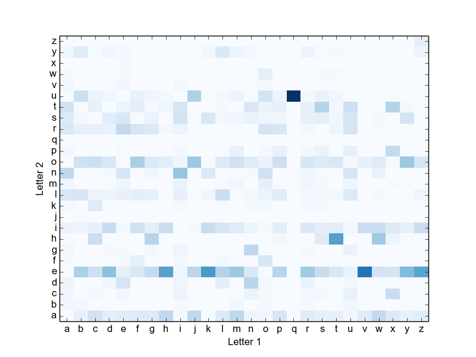
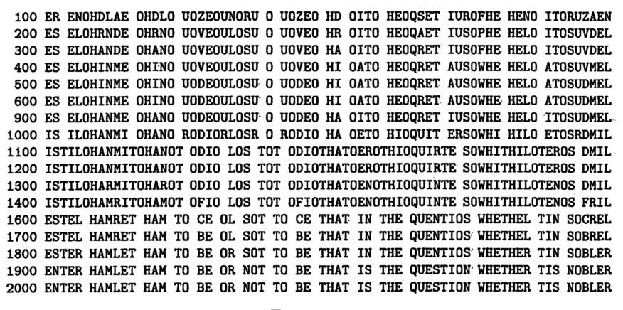

% Monkey See, Monkey Read: Orthographic Processing in Baboons (Papio
  papio)
% Grainger et al., 2012
% 

* * * * *

* * * * *

Word Recognition and Lexical Decisions
--------------------------------------

-   Pretty simple task: present a word, ask the subject "is this a
    word?"
-   The "no" trials are nonwords: character strings that don't form real
    words

* * * * *

Levels of processing
--------------------

* * * * *

Does the lexical decision task actually require this?
-----------------------------------------------------

-   Do you need to access your internal representations to make
    decisions about:

    -   'COOK' and 'XUNQ'?
    -   'LEAP' and 'RIST'?

* * * * *

Teaching monkeys to read
------------------------

-   6 socially-housed baboons with no prior exposure to written language
-   Starting testing sessions whenever they want.
-   Testing sessions are blocks of 100 trials: all monkeys did 40,000+
    trials across the whole experiment

* * * * *

* * * * *

Testing blocks
--------------

Each 100 trial block consists of:

-   25 presentations of a new word
-   25 previously learned words
-   50 nonwords

Words are considered learned when the monkey reaches 80% accuracy for
that word within a block.

Note: for the baboons, a word is something they've seen before, a
nonword is something new (or only seen very rarely).

* * * * *

Example words and nonwords
--------------------------

  Words   Nonwords
  ------- ----------
  born    sner
  make    onfs
  pane    knec
  week    hilb
  limp    grig

* * * * *

The Overall Results
-------------------

* * * * *

Some preliminary conclusions
----------------------------

-   Monkeys are capable of learning the kinds of detailed visual
    information that is required for reading.
-   Human reading might be built on capacities that were already present
    in chimps, rather than abilities that were evolved more recently.

> The primate brain might therefore be better prepared than previously
> thought to process printed words, hence facilitating the initial steps
> toward mastering one of the most complex of human skills: reading

* * * * *

* * * * *

The interesting parts
---------------------

-   Towards the end, monkeys were more likely to classify novel real
    words as words.
-   Monkeys obviously aren't making decisions about these stimuli based
    on whether they're "real English words"
-   So, what sources of information *are* they using to make these
    decisions?

* * * * *

Word-like words and nonword-like nonwords
-----------------------------------------

Bigrams: `wasp -> wa, as, sp`

Bigram frequency: how often each pair of letters occurs in English
words/text.

-   Mean bigram frequency for words in the experiment: $3.6 \times 10^{-4}$
-   For nonwords: $5.96 \times 10^{-5}$

* * * * *

Statistical structure in language
---------------------------------

* Language is too complex and inconsistent to be easily captured by rules
* *But:* there are clear patterns and consistencies that appear when you
  examine large amounts of text.

---------

* * * * *

## Letter probabilities

From bigram counts, you can get the conditional probability of letters, given the
letter that came before them:

$P(L_2|L_1) = \frac{\text{Count}(L_1, L_2)}{\text{Count}(L_1)}$

And you can extend this approach up to trigrams, 4-grams, and 5-grams:

$P(L_3|L_1,L_2) = \frac{\text{Count}(L_1, L_2, L_3)}{\text{Count}(L_1, L_2)}$

----------

Diaconis, P. (2008). The Markov chain Monte Carlo revolution. Bulletin
of the American Mathematical Society, 46(2), 179–205.

* * * * *

---------

## Back to humans

* Baboons seem to be able to build up some sort of memory for which letters
  follow which letters, and make lexical decisions based on this.
* How do we know that humans aren't doing this?
     * Human studies deliberately use nonwords that are more similar in bigram
       frequency
     * But: even if you choose a good automated process for choosing nonwords,
       the nonwords can end up similar to each other, because they're being
       generated by the same process (see Keuleers and Brysbaert, 2011)

---------

## Finally

[Youtube video of the experimental setup](http://www.youtube.com/watch?v=WTAl3x9PngI)