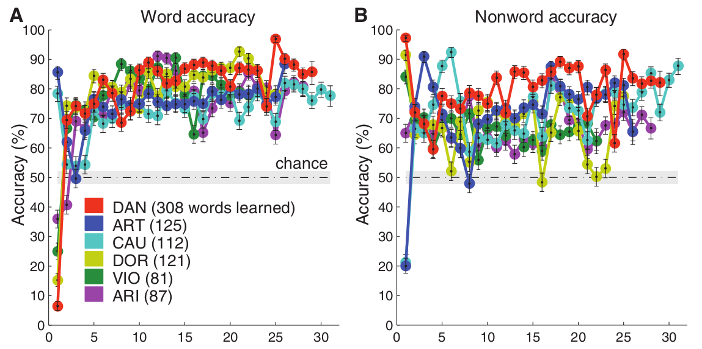
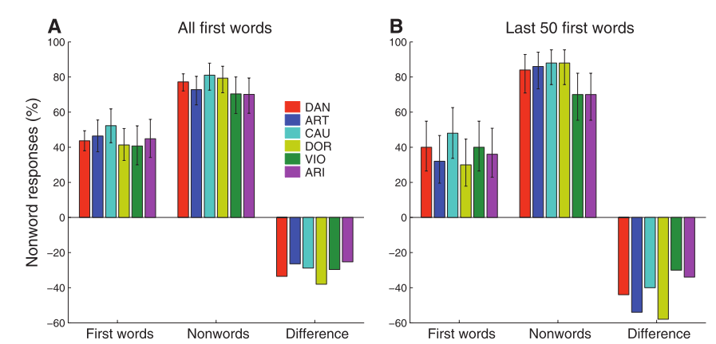
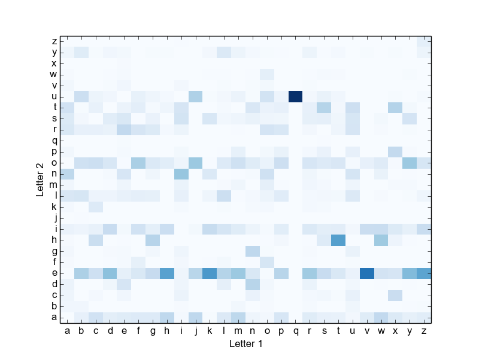
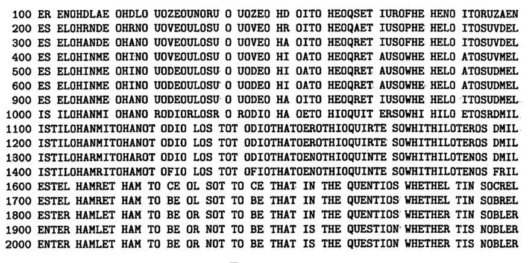

% Monkey See, Monkey Read: Orthographic Processing in Baboons (Papio
  papio)
% Grainger et al., 2012
% 

* * * * *

* * * * *

Okay, so this presentation is based around an experiment that's
definitely a learning experiment, but is probably more located in the
field of reading, so what I thought I'd do was go over the procedure for
the experiment first, just treating it as a learning experiment and
maybe seeing what people think about it in those terms, and then get on
to the language aspects of it later on.

* * * * *

Word Recognition and Lexical Decisions
--------------------------------------

-   Pretty simple task: present a word, ask the subject "is this a
    word?"
-   The "no" trials are nonwords: character strings that don't form real
    words

The basis of a lot of reading research has been the lexical decision
experiment, where you basically present a subject with a string of
characters and ask them "is this a word?". The words are presented along
with nonwords, strings of characters that are hopefully similar enough
to words that you can't immediately dismiss them. Accuracy is generally
high enough that you can't really get much useful information from it,
so what you're typically measuring is reaction times.

* * * * *

Levels of processing
--------------------

What I think the lexical decision task is basically trying to achieve,
and the reason why it's used so widely, is that when you have two groups
of words differing on some dimension that you want to compare, making a
lexical decision about them hopefully requires subjects to process them
to the point where they're accessing information about *words*, not just
strings of letters.

So here I've got a simple diagram of the classic interactive activation
model, which is showing the levels of representation that visual
information passes through when you're reading a word- seeing a word
activates letter features, which activates letters, which activates word
representations. By the time you've got to this point, I think you're
mostly assuming that you've only recognized the word, not necessarily
activated its meaning- different theories have different things to say
about how much meaning or phonology feeds into this word recognition
process. But the idea is that if readers are processing the things
they're seeing up to this level, they're matching them up to the set of
words they know.

* * * * *

Does the lexical decision task actually require this?
-----------------------------------------------------

-   Do you need to access your internal representations to make
    decisions about:

    -   'COOK' and 'XUNQ'?
    -   'LEAP' and 'RIST'?

So at this point, the main question you're left with, is does the
lexical decision task actually involve that level of processing? And
that's what the experiment I'm going to talk about gets at.

* * * * *

Teaching monkeys to read
------------------------

-   6 socially-housed baboons with no prior exposure to written language
-   Starting testing sessions whenever they want.
-   Testing sessions are blocks of 100 trials: all monkeys did 40,000+
    trials across the whole experiment

So here's the experimental setup that Grainger and his colleagues were
using: there are 6 baboons with microchips in their arms, and they have
free access to computer testing booths. I think in the actual monkey
habitat there are lots of monkeys, all potentially part of different
experiments at different times, so when they enter a booth, the
microchip identifies them and the computer sets up the appropriate
experiment. This seems to work fairly well: in the one and a half months
that the experiment ran for, all the monkeys did forty to fifty thousand
trials.

* * * * *

Each trial is a lexical decision, very similar to how a lexical decision
task works for human subjects: a word is presented, then an oval and
cross appear, where the oval is the word response and the cross is the
nonword response. When the baboons respond, they either get a wheat
biscuit or a they see a green screen for a few seconds.

* * * * *

Testing blocks
--------------

Each 100 trial block consists of:

-   25 presentations of a new word
-   25 previously learned words
-   50 nonwords

Words are considered learned when the monkey reaches 80% accuracy for
that word within a block.

Note: for the baboons, a word is something they've seen before, a
nonword is something new (or only seen very rarely).

So within each 100 trial block, there's a new word to learn that is
presented 25 times, 25 words that are randomly chosen from the set of
words the monkey has already learned, and 50 nonwords, randomly chosen
from a pool of 7,000+.

* * * * *

Example words and nonwords
--------------------------

  Words   Nonwords
  ------- ----------
  born    sner
  make    onfs
  pane    knec
  week    hilb
  limp    grig

So, here's some examples of the words that the monkeys are learning in
this experiment, and we'll come back to exactly how these were
constructed later.

Obviously words are being seen much more often than nonwords, which are
only going to be seen every once in a while, so from the baboon's
perspective, what they're responding to is basically a string of
characters they've seen before.

As they start to learn the new words, which they've defined as reaching
80% accuracy, these words are added to the pool of words that they've
already learned, and a different word is brought in as the novel word to
learn.

* * * * *

The Overall Results
-------------------

Okay, so we've covered the basic design, and this point I want to kind
of jump ahead to the results, because although this graph is sort of the
main result in terms of the monkeys learning to do the task, it's
actually not necessarily the most interesting part of the experiment.
So, basically, the monkeys are able to learn this task to a decent
degree of accuracy: they tend to start off just making one response, but
they're fairly quick to actually learn to respond correctly to
previously seen versus novel stimuli.

* * * * *

Some preliminary conclusions
----------------------------

-   Monkeys are capable of learning the kinds of detailed visual
    information that is required for reading.
-   Human reading might be built on capacities that were already present
    in chimps, rather than abilities that were evolved more recently.

> The primate brain might therefore be better prepared than previously
> thought to process printed words, hence facilitating the initial steps
> toward mastering one of the most complex of human skills: reading

Even from these broad results, there's some quite interesting
conclusions you can draw- the most important thing these results show is
that our capacity for reading is probably based in large part on
capacities that were already present earlier in our evolutionary
history. One of the things that's quite interesting about reading is
that it appeared so recently and spread so quickly that it's not likely
to be something that's evolved through being specifically selected for,
there isn't really enough time for that to have occurred. So this goes
along with what a lot of people have been saying about reading and human
language more generally- it builds on capacities that were evolved for
other purposes.

* * * * *

* * * * *

The interesting parts
---------------------

-   Towards the end, monkeys were more likely to classify novel real
    words as words.
-   Monkeys obviously aren't making decisions about these stimuli based
    on whether they're "real English words"
-   So, what sources of information *are* they using to make these
    decisions?

So, now we're getting to the parts of the experiment that are more
interesting from a language perspective. As well as learning to respond
"word" to stimuli that they'd already seen, the baboons seemed to learn
something about what words and nonwords look like, because when new
words were presented for the first time, the baboons were more likely to
classify them as words than novel nonwords. The reason they're able to
do this has a lot to do with the specific way the nonwords and words in
this experiment were chosen, so I've sort of cheated by witholding that
from you up to now.

* * * * *

Word-like words and nonword-like nonwords
-----------------------------------------

Bigrams: `wasp -> wa, as, sp`

Bigram frequency: how often each pair of letters occurs in English
words/text.

-   Mean bigram frequency for words in the experiment: $3.6 * 10^{-4}$
-   For nonwords: $5.96 * 10^{-5}$

One of the simplest ways you can measure "wordlikeness" for these
purposes is to look at the "bigram frequency", how often each pair of
letters occurs in English words. This is a very simple way of
quantifying how a string of letters compares to real English text, but
it's surprisingly effective.

The words and nonwords in this experiment were specifically chosen so
that their distributions of mean bigram frequency had no overlap, so if the
monkeys *were* able to pick up on this statistical difference in the stimuli,
that probably helped a lot in their ability to make some kind of guess about
novel words and nonwords.

* * * * *

Statistical structure in language
---------------------------------

* Language is too complex and inconsistent to be easily captured by rules
* *But:* there are clear patterns and consistencies that appear when you
  examine large amounts of text.

What this is getting at is there are some fairly consistent statistical
patterns in language that are probably making it more learnable. If you look
at any large sample of text (here I've got Moby Dick, because it's an obvious
place to get a lot of words), you'll see consistent (but not necessarily
identical) patterns in which letters are paired together, which words are
paired together, and so on.

---------

* * * * *

Diaconis, P. (2008). The Markov chain Monte Carlo revolution. Bulletin
of the American Mathematical Society, 46(2), 179–205.

* * * * *
